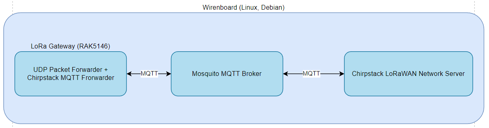
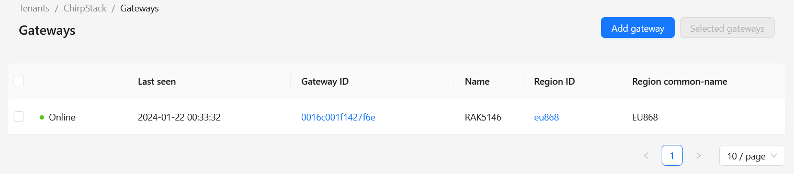
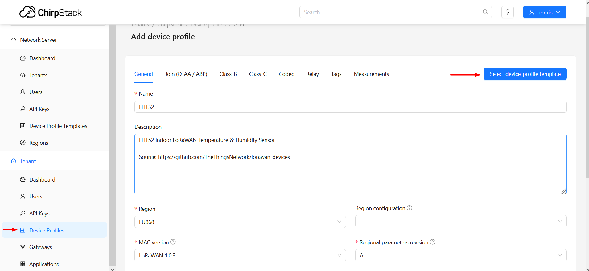
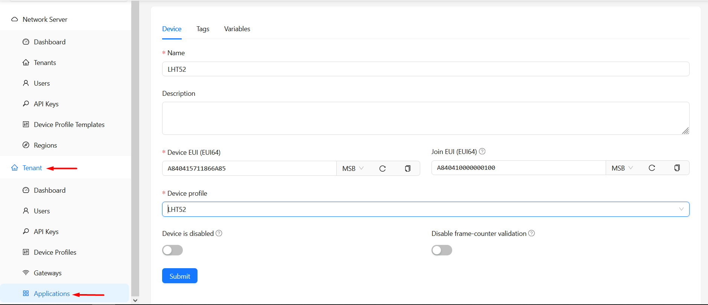
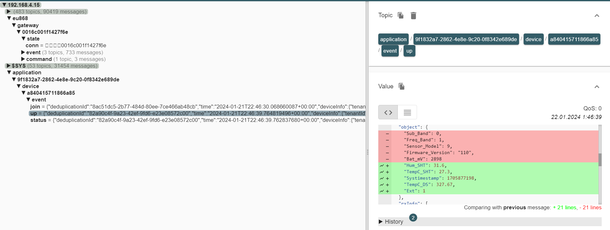

# Запуск Chirpstack LoRaWAN Network сервера на WirenBoard 7 на базе концентратора RAK5146 USB
В папке *[configs](https://github.com/timsmolyanin/rak5146_chirpstack-based-lorawan-gateway/tree/main/configs)* лежат конфигурационные файлы для сервисов, а также файлы для *systemd*.

В папке *[distr](https://github.com/timsmolyanin/rak5146_chirpstack-based-lorawan-gateway/tree/main/distr)* лежат исходники *UDP Packet Forwarder* сервиса и скомпилированный *Chirpstack MQTT Forwarder*.


Общая структура необходимых сервисов для поддержки LoRaWAN выглядит так (хотя существуют еще варианты, смотреть [здесь](https://www.chirpstack.io/docs/architecture.html)::

Ниже перечислены используемые программно-аппаратные решения со ссылками на них:
- **[Wirenboard 7](https://wirenboard.com/wiki/Wiren_Board_7.4) (HW: 7.3.3E/6). ОС Debian 11 bullseye** (wb-2401);
- **[RAK5146](https://docs.rakwireless.com/Product-Categories/WisLink/RAK5146/Datasheet/#overview) USB концентратор**;
- **[mPCIe to USB Board](https://store.rakwireless.com/products/mpcie-to-usb-board)**;
- **[LHT52 Temperature and Humidity sensor](https://www.dragino.com/products/temperature-humidity-sensor/item/199-lht52.html)**;
- **[sx1302_hal](https://github.com/Lora-net/sx1302_hal)**;
- **[Chirpstack MQTT Forwarder](https://www.chirpstack.io/docs/chirpstack-mqtt-forwarder/index.html)**;
- **[Chirpstack LoRaWAN Network Server](https://www.chirpstack.io/)**.

## UDP Packet Forwarder
Данный сервис предназначен для передачи RF сигналов, принимаемых концентратором на серверную часть по **IP/UDP** соединению, и передачи данных с серверной части по RF каналу.
### Компиляция исходников сервиса
Для удобства в корне можно создать директорию *lorawan*, куда будут складываться все необходимые исходники или уже скомпилированные исполняемые файлы перечисленных сервисов для их дальнейшей установки, запуска.
С данного [репозитория](https://github.com/Lora-net/sx1302_hal.git) необходимо забрать исходники сервиса:
```bash
git clone https://github.com/Lora-net/sx1302_hal.git
```
Далее перейти в директорию с Makefile
```bash
cd lorawan/sx1302_hal/
```
и запустить утилиту *make* для компиляции:
```bash
make
```
И ждать пока она завершится.

Если при вводе команды *make* система ругается, что не знает такой команды, то установить все необходимые инструменты для компиляции можно введя команды:
```bash
# обновить список доступных пакетов
apt update
# интсрументарий для компиляции и сборки
apt install libz-dev libgdbm-dev libssl-dev libexpat1-dev libffi-dev cmake gcc
```
Должен начаться процесс компиляции, в результате в директории *lorawan/sx1302_hal/packet_forwarder* должен появиться исполняемый файл *lora_pkt_fwd*. 

### Запуск
Если модуль концентратор еще не вставлен в USB разъем - необходимо вставить его. Далее необходимо создать файл конфигурации *global_conf.json* В директории *sx1302_hal/packet_forwarder* лежат некотрое кол-во примеров такого файла для разных частот, интерфейсов (USB, SPI), на основе которых можно создать файл конфигурации. 
Главное внимательно пройтись по пунктам и заполнить все в соответствии с тем, какой концентратор используется (RAK2247 или другой, например). Для RAK5146 USB можно за основу взять [данный](https://github.com/timsmolyanin/rak5146_chirpstack-based-lorawan-gateway/blob/main/configs/global_conf.json) конфигурационный файл.

После создания конфигурационного файла его надобно положить в директорию *lorawan/sx1302_hal/packet_forwarder*.
Далее можно пробовать запустить сервис *lora_pkt_fwd*:
```bash
# переходим в директрию с исполняемым файлом сервиса
cd lorawan/sx1302_hal/packet_forwarder
# запускаем
./lora_pkt_fwd
```
Он сам прошерстит по директории, в который запускается и будет искать конфигурационный файл.
Если запускать без наличия конфигурационного файла в указанной директории, то сервис будет соответственно ругаться:
```bash
ERROR: [main] failed to find any configuration file named global_conf.json
```
Ну а если никаких ошибок не возникло, то сервис будет выводить разного рода отладочную информацию, типа:
```bash
### Concentrator temperature: 28 C ###
##### END #####

JSON up: {"stat":{"time":"2024-01-20 17:43:15 GMT","rxnb":1,"rxok":1,"rxfw":1,"ackr":0.0,"dwnb":0,"txnb":0,"temp":27.6}}
```
Если такого рода сообщения появились, то значит все прошло успешно.
Можно добавить данный сервис в *systemd*, чтобы он запускался автоматически с запуском системы. Вот рабочий [пример](https://github.com/timsmolyanin/rak5146_chirpstack-based-lorawan-gateway/blob/main/configs/lora_pkt_forwarder.service) этого файла.

Данный файл надо положить в */etc/systemd/system/*
После того, как файл оказался в директории */etc/systemd/system/* нужно выполнить ряд команд:
```bash
# перезапуск systemd
systemctl daemon-reload

# добавляем в автозапуск
systemctl enable lora_pkt_forwarder

# стратруем сервис
systemctl start lora_pkt_forwarder
```
Ну и проверить, что сервис запустился:
```bash
systemctl status lora_pkt_forwarder
```
Если все хорошо, должно быть в выводе что-то такое:
```bash
lora_pkt_forwarder.service - LoRa UDP Packet Forwarder Service
     Loaded: loaded (/etc/systemd/system/lora_pkt_forwarder.service; enabled; vendor preset: enabled)
     Active: active (running) since Sat 2024-01-20 17:54:50 UTC; 4min 12s ago
   Main PID: 29435 (lora_pkt_fwd)
      Tasks: 6 (limit: 2354)
     Memory: 308.0K
        CPU: 8.067s
     CGroup: /system.slice/lora_pkt_forwarder.service
             └─29435 /root/lorawan/sx1302_hal/packet_forwarder/lora_pkt_fwd -c /root/lorawan/sx1302_hal/packet_forwarder/global_conf.json
```
На этом установка UDP Packet Forwarder сервиса завершается.

## Chirpstack MQTT Forwarder
Данный сервис необходим для перенаправления данных из UDP Packet Forwarder сервиса в MQTT брокер. На Wirenboard уже установлен MQTT брокер Mosquito, поэтому нет необходимости его ставить.

Для удобства можно создать директорию *chirpstack_mqtt_forwarder* перейти в нее и скачать архив:
```bash
# создаем директорию
mkdir chirpstack_mqtt_forwarder

# переходим в нее
cd chirpstack_mqtt_forwarder

# получаем архивчик
wget https://artifacts.chirpstack.io/downloads/chirpstack-mqtt-forwarder/chirpstack-mqtt-forwarder_4.1.3_linux_armv7hf.tar.gz
```
Распаковываем архив:
```bash
tar -xvzf chirpstack-mqtt-forwarder_4.1.3_linux_armv7hf.tar.gz
```
В результате получаем уже скомпилированный файл *chirpstack-mqtt-forwarder*. Для его запуска ему нужен конфигурационный файл *chirpstack-mqtt-forwarder.toml*. Получить информацию об нем, как его заполнять можно [здесь](https://www.chirpstack.io/docs/chirpstack-mqtt-forwarder/configuration.html). Также можно просто взять [данный](https://github.com/timsmolyanin/rak5146_chirpstack-based-lorawan-gateway/blob/main/configs/chirpstack-mqtt-forwarder.toml) рабочий пример и положить его в директорию с исполняемым файлом *chirpstack-mqtt-forwarder*.
Этот файл нужно положить в папку с исполняемым файлом и затем попробовать запустить:
```bash
./chirpstack-mqtt-forwarder
```
На выходе в случае успеха сервис будет выводить отладочную информацию, где можно будет увидеть, что сервис получает ответы от *UDP Packet Forwarder*, и что он смог подключиться к MQTT брокеру.
Его также можно добавить в *systemd*, файл сервиса можно поглядеть соответственно [здесь](https://github.com/timsmolyanin/rak5146_chirpstack-based-lorawan-gateway/blob/main/configs/chirpstack_mqtt_forwarder.service).
Процедура добавления аналогична той, что была описана выше для *UDP Packet Forwarder*, можно те же действия для данного сервиса повторить.
После добавления и запуска сервиса, если при проверке статуса все хорошо, то значит сервис работает и на этом его установка и запуск закончены.
## Chirpstack LoRaWAN Network Server
Этот сервис обозначает уровень, на котором мы сможем настраивать наш концентратор или даже концентраторы, смотреть за их работой, добавлять LoRaWAN устройства (датчики и прочие штуки). На этом же уровне данные с датчика декодируются в человекочитаемый вид. С точки зрения данных, данный сервис берет из MQTT брокера сырые данные, декодирует их и отправляет составленный JSON с декодированными данными обратно в MQTT брокер, где их уже можно распарсить своим приложением и что-то с данными делать.
Ниже будет приводится более-менее шаги, описанные [здесь](https://www.chirpstack.io/docs/getting-started/debian-ubuntu.html), но с некоторыми отличиями.
Для начала нужно поставить несколько пакетов (MQTT штуки ставить не нужно):
```bash
apt install redis-server redis-tools postgresql
```
Если все успешно двигаемся дальше
### Настройка PostgreSQL
Заходим в PostgreSQL:
```bash
sudo -u postgres psql
```

И далее вводим следующее:
```sql
-- create role for authentication
create role chirpstack with login password 'chirpstack';

-- create database
create database chirpstack with owner chirpstack;

-- change to chirpstack database
\c chirpstack

-- create pg_trgm extension
create extension pg_trgm;

-- exit psql
\q
```
### Установка репозитария программного обеспечения
Далее нужно установить какую-то штуку:
```bash
apt install apt-transport-https dirmngr
```
Установить ключ для репозитория ChirpStack:
```bash
apt-key adv --keyserver keyserver.ubuntu.com --recv-keys 1CE2AFD36DBCCA00
```
Добавить репозиторий в список:
```bash
echo "deb https://artifacts.chirpstack.io/packages/4.x/deb stable main" | sudo tee /etc/apt/sources.list.d/chirpstack.list
```
Обновить список доступных пакетов:
```bash
apt update
```

### Установка ChirpStack
Собственно, устанавливаем *Chirpstack* из репозитория:
```bash
apt install chirpstack
```
Запускаем *Chirpstack*:
```bash
# стартуем сервис chirpstack
systemctl start chirpstack

# добавляем в автозагрузку сервис chirpstack
systemctl enable chirpstack
```
Поглядеть логи:
```bash
journalctl -f -n 100 -u chirpstack
```
Если все успешно, то можно переходить на веб-страничку сервиса и начать добавление концентратора и датчиков.
> 
>P.S. В логах можно будет увидеть ошибку, связанную с тем, что *Chirpstack* не
> знает EUI концентратора, который ему прилетает - это норма, т.к. мы еще не добавили
> концентратор в наш *Chirpstack* сервер, после добавления ошибка, соответственно
> исчезнет.

## Работа с Chirpstack
### Добавление концентратора
Переходим на веб страничку нашего Chirpstack LoRaWAN Network Server. Это IP адрес машины, к которой подключен концентратор с указанием порта 8080.

Вход *admin/admin*

Переходим в меню *Tenant/Gateways* и добавляем наш концентратор. Там все достаточно просто, подробно здесь не останавливаемся.
В конечном итоге мы должны будем увидеть, что концентратор в *online*, если введенные данные корректны.


### Добавление датчика
Будем рассматривать данный процесс на примере добавления датчика *[LHT52](https://www.dragino.com/products/temperature-humidity-sensor/item/199-lht52.html)* от *Dragino*.
 Прежде всего нужно будет добавить *device profiles* для данного датчика в *Chirpstack*. *Device profiles* определяют возможности устройства и параметры загрузки, которые *Chirpstack* сервер использует для настройки службы радиодоступа LoRaWAN. Он включает в себя выбор таких параметров, как частотный диапазон LoRa, версия региональных параметров LoRa и версия MAC устройства. 

Каждый производитель LoRaWAN датчиков и прочих штук составляет эти самые профили устройств, полный список можно посмотреть [здесь](https://github.com/brocaar/lorawan-devices). 

Можно добавить весь этот список, но он достаточно большой и скорее всего для небольшой инсталяции 99% этого списка не пригодится, поэтому можно взять только того производителя, устройства которого планируется использовать, например *Dragino*. Хотя проще не заморачиваться и забрать все целиком.
Клонируем репозиторий к себе:
```bash
git clone https://github.com/brocaar/lorawan-devices /opt/lorawan-devices
```
Единственное, при таком варианте в итоге в папке *lorawan-devices* будет еще одна папка *lorawan-devices-master*, следует перетащить все полезные внутренности на уровень выше, чтобы все полезное и нужное было */opt/lorawan-devices*. 
Вот так оно должно выглядеть:
```bash
root@wirenboard-ARG3Y62N:/opt/lorawan-devices# ls -lah
total 168K
drwxr-sr-x 9 root root 4.0K Jan 21 21:54 .
drwxr-sr-x 3 root root 4.0K Jan 21 21:53 ..
-rw-r--r-- 1 root root  243 Jan 21 21:54 .editorconfig
drwxr-sr-x 4 root root 4.0K Jan 21 21:54 .github
-rw-r--r-- 1 root root  118 Jan 21 21:54 .gitignore
-rw-r--r-- 1 root root   47 Jan 21 21:54 .prettierrc
-rw-r--r-- 1 root root  193 Jan 21 21:54 CODEOWNERS
-rw-r--r-- 1 root root  10K Jan 21 21:54 LICENSE
-rw-r--r-- 1 root root 1.1K Jan 21 21:54 Makefile
-rw-r--r-- 1 root root  14K Jan 21 21:54 README.md
drwxr-sr-x 2 root root 4.0K Jan 21 21:54 bin
drwxr-sr-x 2 root root 4.0K Jan 21 21:54 doc
drwxr-sr-x 2 root root 4.0K Jan 21 21:54 lib
-rw-r--r-- 1 root root  41K Jan 21 21:54 package-lock.json
-rw-r--r-- 1 root root  933 Jan 21 21:54 package.json
-rw-r--r-- 1 root root  33K Jan 21 21:54 schema.json
drwxr-sr-x 4 root root 4.0K Jan 21 21:53 tools
drwxr-sr-x 4 root root 4.0K Jan 21 21:53 vendor
drwxr-sr-x 8 root root 4.0K Jan 21 21:53 website
root@wirenboard-ARG3Y62N:/opt/lorawan-devices#
```

Конкретно в случае с контроллером WirenBoard, ввиду ограниченного объема памяти в корневом разделе лучше будет запихнуть всю эту штуку в */mnt/data/*, где места побольше, а в */opt* положить симлинк на это дело:
```bash
# перейдем сюда
cd /opt

# создание симлинка
ln -s /mnt/data/lorawan-devices lorawan-devices 
```

Далее нужно добавить в *Chirpstack* сервер эти профили устройств, которые мы добавили:
```bash
chirpstack -c /etc/chirpstack import-legacy-lorawan-devices-repository -d /opt/lorawan-devices
```
Ждем какое-то время (несколько минут в случае с WirenBoard 7). Когда процесс завершится переходим в веб-страничку *Chirpstack*.

Первым делом нужно создать шаблон профиля устройств добавляемого датчика. Переходим в *Tenant/Device Profiles* и заполняем формочки:


После этого переходим в *Tenant/Applications* и первым делом создаем *Application*. Далее жмем добавить устройство. Вводим все необходимые данные (*DEV EUI, APP EUI*), называем как-то устройство, выбираем ранее созданный шаблон профиля устройств.

После подтверждения заходим в добавленный датчик и главное не забыть в поле *OTAA keys* добавить *APP KEY*. Вся эта информация (*DEV EUI, APP EUI, APP KEY*) должна быть где-то в коробке с устройством, так что коробку лучше не выбрасывать сразу :)

После всех этих дел находим на датчике кнопку (а если в датчике нет батарейки - вставляем) и нажимаем коротко один раз. Датчик должен добавиться.

## Доступ к данным из сторонних приложений
Данные с добавленного датчика доступны в MQTT брокере. Например можно в этом убедиться поглядев в [*MQTT Explorer*](http://mqtt-explorer.com/).
.

Данные можно забрать питоновским скриптом, соответственно:
```python
import paho.mqtt.client as mqtt

# The callback for when the client receives a CONNACK response from the server.
def on_connect(client, userdata, flags, rc):
    print("Connected with result code "+str(rc))
    
    # Subscribing in on_connect() means that if we lose the connection and
    # reconnect then subscriptions will be renewed.
    client.subscribe("application/9f1832a7-2862-4e8e-9c20-0f8342e689de/device/a840415711866a85/event/up")

# The callback for when a PUBLISH message is received from the server.
def on_message(client, userdata, msg):
    print(msg.topic+" "+str(msg.payload))
    raw_data = str(msg.payload)
    # print(raw_data)

client = mqtt.Client()
client.on_connect = on_connect
client.on_message = on_message

client.connect("192.168.4.15", 1883)

# Blocking call that processes network traffic, dispatches callbacks and
# handles reconnecting.
# Other loop*() functions are available that give a threaded interface and a
# manual interface.

client.loop_forever()
```

Получаем вот такой JSON, из которого без труда можно достать нужные данные:
```json
application/9f1832a7-2862-4e8e-9c20-0f8342e689de/device/a840415711866a85/event/up b'{"deduplicationId":"0bf37eb1-2d13-4cbb-b0a0-65ec82e75ea0","time":"2024-01-21T23:09:18.655164839+00:00","deviceInfo":{"tenantId":"52f14cd4-c6f1-4fbd-8f87-4025e1d49242","tenantName":"ChirpStack","applicationId":"9f1832a7-2862-4e8e-9c20-0f8342e689de","applicationName":"Sensors","deviceProfileId":"f35e1cad-8571-405d-85c3-e4c6b01c4e90","deviceProfileName":"LHT52","deviceName":"LHT52","devEui":"a840415711866a85","deviceClassEnabled":"CLASS_A","tags":{}},"devAddr":"01ffe479","adr":true,"dr":0,"fCnt":0,"fPort":5,"confirmed":false,"data":"CQEQAQALWA==","object":{"Sensor_Model":9.0,"Firmware_Version":"110","Freq_Band":1.0,"Bat_mV":2904.0,"Sub_Band":0.0},"rxInfo":[{"gatewayId":"0016c001f1427f6e","uplinkId":2939478758,"nsTime":"2024-01-21T23:09:18.412477686+00:00","rssi":-56,"snr":12.0,"channel":3,"location":{},"context":"uDnejw==","metadata":{"region_common_name":"EU868","region_config_id":"eu868"},"crcStatus":"CRC_OK"}],"txInfo":{"frequency":867100000,"modulation":{"lora":{"bandwidth":125000,"spreadingFactor":12,"codeRate":"CR_4_5"}}}}'
```
Вот в общем-то и все!